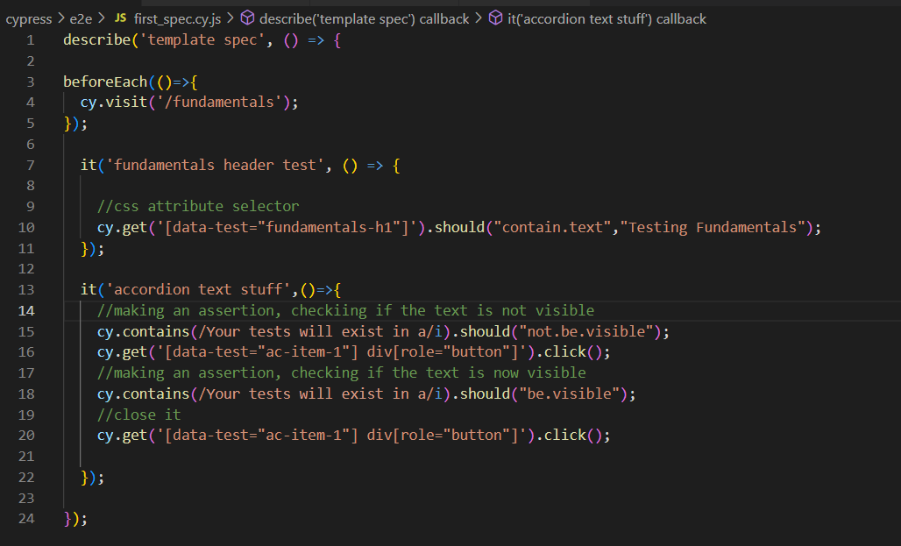
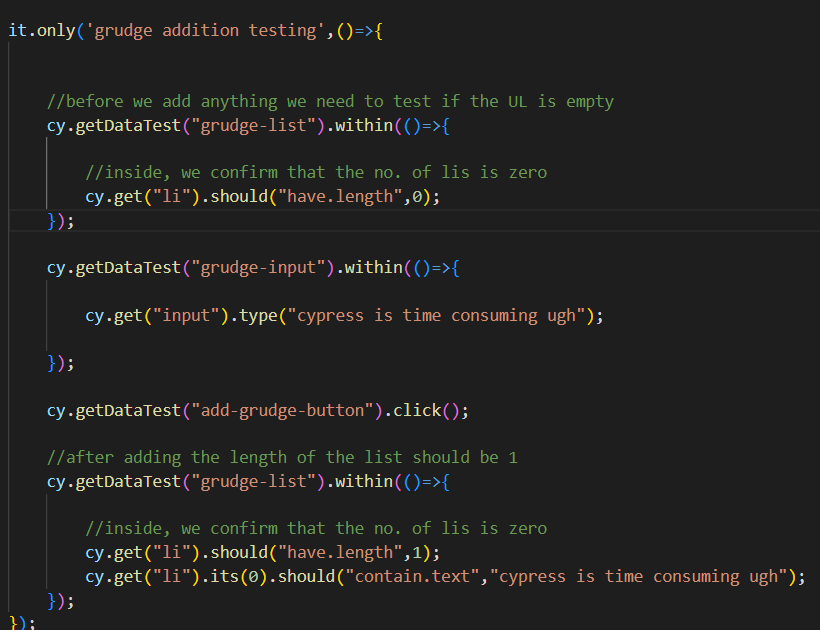

Cypress is a javascript testing framework

Ran E2E and component tests on

Cypress Features used in this demo:

Base URL

Commands

Alias

Intercepts

Fixtures

You can test your application on  2 levels:

1. End to end
2. Component level

To start off with Cypress I decided to follow a course on youtube; I will be documenting my learning journey here on github so others can refer to this repository and dip their feet into the world of javascript testing using Cypress with ease.

This project is a Next.js project- after running npm install to install all the dependencies- I installed cypress.

To run cypress type ‘npx cypress open’.

This window appears: (note that this is an electron based application, not exactly native)

Here you can see the two types of testing you can perform with cypress.

To start things off, I will be going with End to end testing first…

After clicking in E2E testing cypress will automatically generate configuration files- once that is done you will arrive here:

I decided to go with microsoft edge.

Spec file is the equivalent of test file, so let us go ahead and create one

Cypress fundamentals:

Describe block:

Tests exists in describe block. First parameter is a description of the test. Second parameter is a callback function which has the actual tests in it (it blocks).

Inside the callback function we write ‘it’ blocks

It blocks are single tests within a test file, first arg is the title of the test second arg is a callback function containing test code. This code is basically a bunch of cypress commands.

These commands can be accessed using the cy object.

Cypress is async, you shouldnt use variables within your tests. Subjects are ‘yielded’.

You would use .then() to perform action on an element acquired as ‘then’s callback parameter you should use cy.wrap(element).action\_name() ….. We are essentially converting it to a cypress object

While selecting elements we should use selectors that will not change throughout a test. Ie we should use constant selectors. **That means we should add a custom attribute to the element that will not change.**

In the example below I want to test the H1 in the fundamentals page- first I need to add a custom constant attribute like so…

How to setup base url:

beforeEach() is used to perform something before each test is run..

Current code:

Code after using beforeEach():

You can also create custom commands. For example a custom getData command so that we wont have to write [data-test….] again and again

This is how to create new commands:

One great feature of cypress is retryability

But sometimes you might want to wait for stuff explicitly like a network request- you can give it an alias and the wait() for that network request

How to create alias? It can be done using as()

example ..

cy.get(“table”).find(“tr”).as(“rows”);

..

..

cy.get(“@rows”); //this will give you the result of that long statement

You can wait for an arbitrary amount of time using cy.wait(time\_in\_ms);

You can get URL details via cy.location()

Intercepts are used when you do not want to constantly hit your live service or some third party service. Example: while testing you would not want to hit AWS again and again

This is how to use intercepts

You can use files as mock response. This can be done using Fixtures.

This is how fixture is used: (your file must be placed in the fixtures folder)

Easy way to value check arrays and objects (using its)

//cy.wrap is wrapping obj or array with cypress object so that it can be used… its would be used on a dom returned val

cy.wrap({name:”rahul”}).its(“name”).should(“eq”,”rahul”);

its () is basically like a selector

cy.request () can be used to make GET POST etc. requests to API

.within() can be used to limit scope

This is how within() can be used:

Component level testing:

Went through a similar setup procedure

Component testing builds components using a development server instead of rendering the complete website- it results in faster tests and fewer dependencies.

You can mount a component using cy.mount

Cypress best practices:

Keep in mind the 7 principles of software testing

Make sure you test unhappy paths

Use data-  attributes, this will prevent flaky behaviour. Ie. tests failing when in reality they shouldn’t

Do not assign return values, cypress is async

Do not test external sites

Keep tests independent

Cleanup state before test run